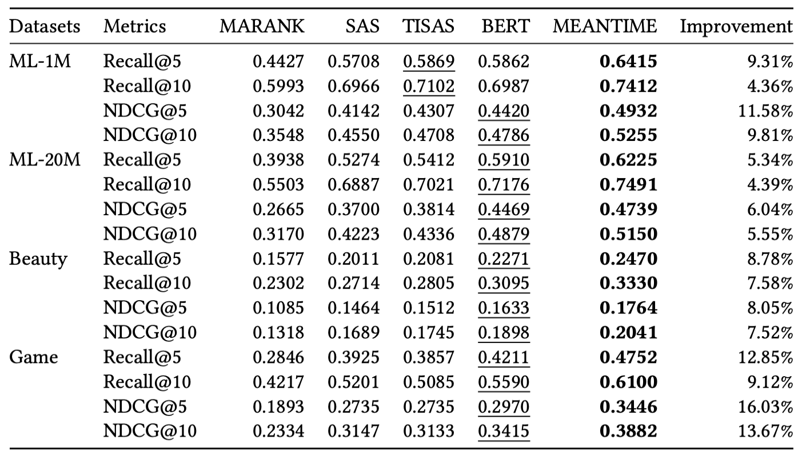

## MEANTIME

Official implementation of
[MEANTIME: Mixture of Attention Mechanisms with Multi-temporal Embeddings for Sequential Recommendation](https://arxiv.org/abs/2008.08273)
, published in [RecSys 2020: 14th ACM Conference on Recommender Systems](https://recsys.acm.org/recsys20/).

This repository contains PyTorch implementation of MEANTIME, as well as PyTorch translations of various baselines (refer to [References](#references) below).

## Setup

Install the required packages into your python environment:

```
pip install -r requirements.txt
```

This code was tested with `python 3.6.9` on `ubuntu` with `cuda 10.1` and various types of GPUs.

## QuickStart

In order to train MEANTIME, run run.py as follows:

```
python run.py --templates train_meantime
```

This will apply all the options specified in `templates/train_meantime.yaml`, and train **MEANTIME** on **MovieLens 1M** dataset as a result.

You can also apply other templates in the `templates` folder. For example,

```
python run.py --templates train_bert
```

will train **BERT4Rec** model instead of **MEANTIME**.

It is also possible to override some options with command line arguments. For example,

```
python run.py --templates train_meantime --dataset_code game --hidden_units 128
```

will use **Amazon Game** dataset and hidden dimension of **128**.

Check out `meantime/options` for all possible options.

## Training

Here is a more detailed explanation of how one can train a model.

We will explain in two levels ('Big' Choices and 'Small' Choices).

Remember that you can always study the template files in `./templates` to learn about desirable choices.

### 'Big' Choices

This project is highly modularized so that any (valid) combination of `model`, `dataset`, `dataloader`, `negative_sampler` and `trainer` will run.

#### Model

Currently, this repository provides implementations of **MEANTIME** and several other baselines ([References](#references)).

Choose one of these for `--model_code` option
* meantime
* marank
* sas
* tisas
* bert

#### Dataset

We experimented with four datasets: **MovieLens 1M**, **MovieLens 20M**, **Amazon Beauty** and **Amazon Game**.

Choose one of these for `--dataset_code` option
* ml-1m
* ml-20m
* beauty
* game

The raw data of these datasets will be automatically downloaded to `./Data` the first time they are required.

They will be preprocessed according to the related hyperparameters and will be saved also to `./Data` for later re-use.

Note that downloading/preprocessing is done only once per every setting to save time.

If you want to change the Data folder's path from `./Data` to somewhere else (e.g. shared folder), modify `LOCAL_DATA_FOLDER` variable in `meantime/config.py`.

#### Dataloader

There is a designated dataloader for each model. Choose the right one for `--dataloader_code` option:
* bert (for **BERT4Rec** and **MEANTIME**)
* sas (for **MARank**, **SASRec** and **TiSASRec**)

The separation is due to the way each model calculates the training loss, and the information they require.

#### Trainer

There is a designated trainer for each model. Choose the right one for `--trainer_code` option
* bert (for **BERT4Rec** and **MEANTIME**)
* sas (for **SASRec** and **TiSASRec**)
* marank (for **MARank**)

However, at this point, all trainers have the exact same implementation thanks to the abstraction given by the models.

#### Negative Sampler

There are two types of negative samplers:
* random (sample by random)
* popular (sample according to item's popularity)

Choose one for `--train_negative_sampler`(used for training) and `--test_negative_sampler`(used for evaluation).

### 'Small' Choices (Hyperparameters)

For every big choice, one can make small choices to modify the hyperparameters that are related to the big choice.

Since there are too many options, we suggest looking at `meantime/options` for complete list.

Here we will just present some of the important ones.

#### Model
* `--max_len`: The length of any transformer-based models
* `--hidden_units`: The size of hidden dimension
* `--num_blocks`: Number of transformer layers
* `--num_heads`: Number of attention heads
* `--absolute_kernel_types`: Absolute Temporal Embedding types to be used in **MEANTIME**. Look at `meantime/options` for further information
* `--relative_kernel_types`: Relative Temporal Embedding types to be used in **MEANTIME**. Look at `meantime/options` for further information

#### Dataset
* `--min_rating`: Minimum rating to regard as implicit rating. Interactions whose rating is below this value will be discarded
* `--min_uc`: Discard users whose number of ratings is below this value
* `--min_sc`: Discard items whose number of ratings is below this value

#### Dataloader
* `--dataloader_output_timestamp`: If true, the dataloader outputs timestamp information
* `--train_window`: How much to slide the training window to obtain subsequences from the user's entire item sequence
* `--train_batch_size`: Batch size for training

#### Trainer
* `--device`: CPU or CUDA
* `--use_parallel`: If true, the program uses all visible cuda devices with DataParallel
* `--optimizer`: Model optimizer (SGD or Adam)
* `--lr`: Learning rate
* `--saturation_wait_epochs`: The training will stop early if validation performance doesn't improve for this number of epochs.
* `--best_metric`: This metric will be used to compare and determine the best model

#### Negative Sampler
* `--train_negative_sample_size`: Negative sample size for training
* `--test_negative_sample_size`: Negative sample size for testing


## Viewing Training Results

### Path

After the training is over, the results will be saved in the folder specified by the options.

More specifically, they are saved in `experiment_root`/`experiment_group`/`experiment_name`

For example, `train_meantime` template has

```
experiment_root: experiments
experiment_group: test
experiment_name: meantime
```

Therefore, the results will be saved in `experiments/test/meantime`.

We suggest the users to modify the `experiment_group` and `experiment_name` options to match their purpose.

### Results

In the result folder, you will find:

```
.
├── config.json
├── models
│   ├── best_model.pth
│   ├── recent_checkpoint.pth
│   └── recent_checkpoint.pth.final
├── status.txt
└── tables
    ├── test_log.csv
    ├── train_log.csv
    └── val_log.csv
```

Below are the descriptions for the contents of each file.

#### Models

* best_model.pth: state_dict of the best model
* recent_checkpoint.pth: state_dict of the model at the latest epoch
* recent_checkpoint.pth.final: state_dict of the model at the end of the training

#### Tables

* train_log.csv: training loss at every epoch
* val_log.csv: evaluation metrics for validation data at every epoch
* test_log.csv: evaluation metrics for test data at best epoch

## Evaluation

If you want to evaluate a pretrained model, you can simply override the `--mode` option and provide path to the `--pretrained_weights`.

For example,
```
python run.py --templates train_meantime --mode validate --pretrained_weights path/to/weights
```
will validate the pretrained model on validation data, and
```
python run.py --templates train_meantime --mode test --pretrained_weights path/to/weights
```
will do the same on test data.

## Results



The above table shows the performance of each model on all four datasets.

We performed grid-search over hyperparameters, and reported optimal results for each combination.

Please refer to our paper for further informaiton.

## Extra Logging Features (which were added for online logging or multi-machine experiments and are probably unnecessary in most use cases but are nontheless preserved in case someone is also in need of those functionalities or just purely interested for whatever reason)

### WANDB

[WANDB](https://www.wandb.com/) is an online service that helps you organize and analyze machine learning experiments.

If you want to log the results to **wandb**:
* install wandb (already in `requirements.txt`)
* change `USE_WANDB` to `True` in `meantime/config.py`
* run `wandb init` in command line to initialize wandb with your own account
* whenever you run an experiment, always specify the following options:
  * wandb_project_name
  * wandb_run_name
  * wandb_id

### REMOTE MACHINE

Sometimes, when there is not enough time to run all the experiments that you wish to run (especially before the paper's due date),
one feels the need to use multiple "remote" machines to run multiple experiments in parallel.

By default, those machines will each save their results in their local result folders (refer to above).

It would be useful if all of those results could be gathered in one designated host machine, making it easy to view and analyze the entire process.

If you want the remote machine to upload their results to the host machine after every experiment:
* install paramiko (already in `requirements.txt`)
* provide values for the following variables in `meantime/config.py`
  * `HOST`(str): ip of the host machine
  * `PORT`(int): port of the host machine
  * `USERNAME`(str): username for ssh/sftp access to host machine
  * `PASSWORD`(str): password for ssh/sftp access to host machine
  * `REMOTE_ROOT`(str): path to this project in the host machine
* change `MACHINE_IS_HOST` to `False` in `meantime/config.py`

## References

The baseline codes were translated to PyTorch from the following repositories:
* **MARANK**: [https://github.com/voladorlu/MARank](https://github.com/voladorlu/MARank)
* **SASRec**: [https://github.com/kang205/SASRec](https://github.com/kang205/SASRec)
* **TiSASRec**: [https://github.com/JiachengLi1995/TiSASRec](https://github.com/JiachengLi1995/TiSASRec)
* **BERT4Rec**: [https://github.com/FeiSun/BERT4Rec](https://github.com/FeiSun/BERT4Rec)

